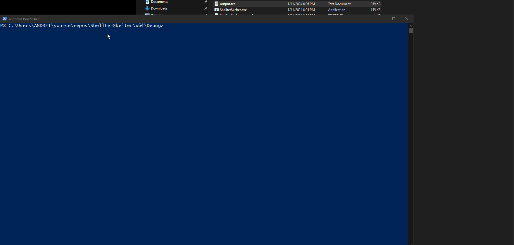

**WIP**

ShellterSkelter is a tool for encrypting/obfuscating payloads. It outputs the encrypted and obfuscated payload into a file, along with the decryption/deobfuscation function.

### Usage

`.\ShellterSkelter payload.bin output.cpp AES MAC`

Supported encryption types:
- NONE (in this case the payload will only be obfuscated)
- XOR
- AES

Supported obfuscation types:
- MACfuscation
- IPv4fuscation

### To-do

- Add RC4
- Add UUIDfuscation
- Add the option to select key size (currently, keys are 128 bits)
- Better padding support

### Example

### Credits

 - AES implementation from [tiny-aes-c](https://github.com/kokke/tiny-AES-c) (included in the libs/ directory)
 - The obfuscation algorithm is a modified version of the one used in [HellShell](https://github.com/NUL0x4C/HellShell)
